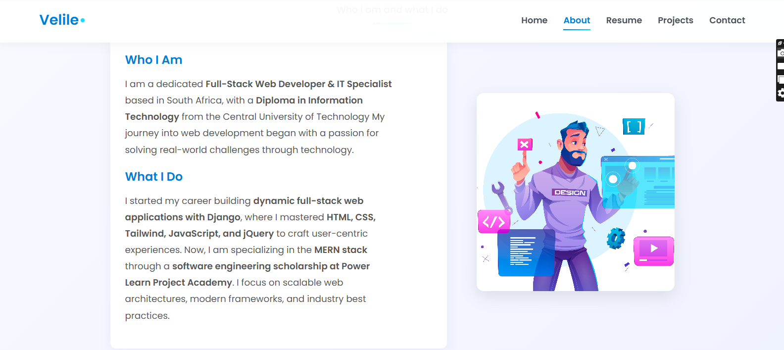

# 👋 Hi there, I'm Velile Mifi

🌍 From Thabong, Welkom, Free State, South Africa  
🎓 Software Development Student @ Power Learn Project  
📚 Self-learner | Open-source contributor | Tech for Good advocate  
💡 Founder of [Bokamoso Foundation](https://bokamosofoundation.org) – Empowering communities through education, food, and digital innovation

---

## 🚀 About Me

I'm passionate about using technology to solve real-world problems, especially those aligned with the **UN Sustainable Development Goals** — particularly **Goal #16: Peace, Justice and Strong Institutions**.

Currently building solutions in:

- 🌱 Sustainable Agriculture  
- 🧠 EdTech for youth empowerment  
- 🌐 Web Development for community impact  

---

## 🎯 90-Day Coding Challenge (Starting May 20, 2025)

A self-imposed challenge to master full-stack development and advanced Django concepts. Projects include:

- 🎬 **Netflix-like Service (Django)**  
  Showcasing proxy models, custom user models, and streaming logic.

- ✍️ **Blog App with Extended Functionality**  
  Features REST APIs, Google OAuth login, user dashboards.

- 🔐 **django-two-factor-auth Integration**  
  Secures Django apps with two-factor authentication.

- 🔐 **dj-rest-auth API Auth Setup**  
  Full REST authentication suite for SPAs/mobile apps.

- 💬 **Real-time Chat App (Django + WebSockets)**  
  Supports private messaging and authentication.

---

## 📌 Other Projects

- 🌾 **Crop Monitoring System** – Real-time analytics for smallholder farmers  
- 🌍 **COVID-19 Global Data Tracker** – A data analysis project to visualize pandemic trends  
- 💻 **Bokamoso Foundation Website** – Community-driven digital presence  
- 🧩 **Crossword Puzzle Game** – Fun + logic + JavaScript!

---

## 🛠️ Tech Stack & Tools

### 💻 Languages & Frameworks

### ⚙️ Frameworks & Libraries

### 🛢️ Databases & DevOps

---

## 📝 Latest Blog Posts

<!-- BLOG-POST-LIST:START -->
- 🚀 [Building a Netflix Clone with Django (Coming Soon)](#)
- 🔐 [Two-Factor Auth in Django: A Step-by-Step Guide (Coming Soon)](#)
- 📡 [Building Real-Time Chat with WebSockets (Coming Soon)](#)
<!-- BLOG-POST-LIST:END -->

---

## 🖼️ GitHub Profile Snapshot

> 🖥️ Check out my portfolio: (https://veetheegod.github.io/web-page-2.0/)

---

---

## 🤝 Let's Connect

  
📬 Email: mifivelile@gmail.com 

> *"Code for impact. Learn for growth. Lead with purpose."*

